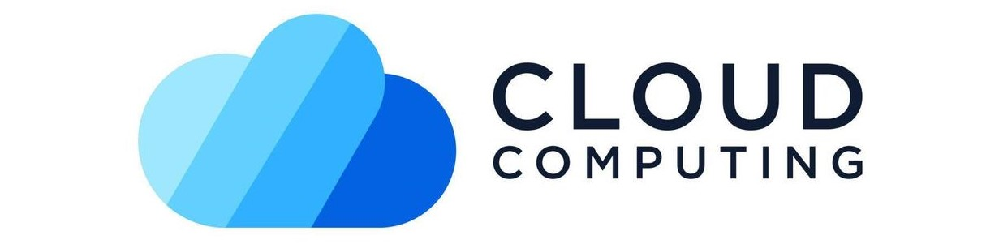

# Cloud Computing

### Virtualization

Virtualization is a technology that allows a single physical computer or server to be divided into multiple virtual machines, or "VMs". These VMs can then run different operating systems or applications while sharing the resources of the host machine.\
🔗 [Virtualization Notes](./assets/Notes/Virtualization.md)

### Hypervisor

A hypervisor is a software, firmware, or hardware component that allows a single physical machine to run multiple virtual machines (VMs).\
🔗 [Hypervisor Notes](./assets/Notes/Hypervisor.md)

### VMware Workstation

VMware Workstation is a desktop virtualization product that allows users to run multiple operating systems on the same computer without rebooting.\
🔗 [VMware Workstation Notes](./assets/Notes/VMware%20Workstation.md)

### VirtualBox

Oracle VirtualBox is a hosted hypervisor for x86 virtualization.\
🔗 [VirtualBox Notes](./assets/Notes/VirtualBox.md)

### Windows Sandbox

Windows Sandbox is a lightweight desktop environment that allows you to run applications in isolation from your host operating system.\
🔗 [Windows Sandbox Notes](./assets/Notes/Windows%20Sandbox.md)

### Hyper-V

Hyper-V is a Microsoft product that allows users to create and run virtual machines (VMs) on a physical host computer.\
🔗 [Hyper-V Notes](./assets/Notes/Hyper-V.md)

#### 📜 [Tasks Week 2](./assets/Lab/TaskWeek2.md)
- [Basic VM Creation and OS Installation](./assets/Lab/TaskWeek2.md#basic-vm-creation-and-os-installation)
- [Observing Power States of VMs in Hyper-V](./assets/Lab/TaskWeek2.md#observing-power-states-of-vms-in-hyper-v)
- [Networking and Virtual Switches](./assets/Lab/TaskWeek2.md#networking-and-virtual-switches)
- [Snapshot Management](./assets/Lab/TaskWeek2.md#snapshot-management)
- [Resource Allocation and Performance Monitoring](./assets/Lab/TaskWeek2.md#resource-allocation-and-performance-monitoring)

### Scalability

Scalability in Cloud Computing refers to the ability of a cloud system to handle increasing or decreasing workloads efficiently. It allows resources such as processing power, storage, and network bandwidth to expand or contract dynamically based on demand.\
This flexibility ensures that businesses can scale up during peak usage periods and scale down during low-demand times, optimizing costs and maintaining performance. Cloud providers offer two types of scalability:

**Vertical Scalability (Scaling Up)**: Increases the capacity of existing hardware by adding more power (e.g., upgrading to a more powerful server).

**Horizontal Scalability (Scaling Out)**: Involves adding more servers or nodes to distribute the load, which is often preferred for handling high-demand workloads.

*Scalability is a core advantage of cloud computing, enabling businesses to grow without the need for massive upfront infrastructure investments.*

🔗🌐 [Horizontal Vs. Vertical Scaling: Which Should You Choose?](https://www.cloudzero.com/blog/horizontal-vs-vertical-scaling/)

### Security Threats in Virtual Machines

**Security Threats in Virtual Machines (VMs)** arise due to the shared nature of virtualized environments, where multiple VMs run on the same physical hardware. Key threats include:

1. **Hypervisor Attacks**: The hypervisor, which manages VMs, can be a target for attackers. Compromising the hypervisor (e.g., through vulnerabilities) allows attackers to control or access all VMs on the host.

2. **VM Escape**: In this scenario, an attacker exploits a vulnerability in a VM to break out and gain control over the host system or other VMs.

3. **Inter-VM Attacks**: If VMs share resources, an attacker in one VM could exploit side-channel attacks or vulnerabilities to access data from another VM.

4. **Snapshot and Data Leakage**: VM snapshots store the complete state of a VM. If snapshots are not properly secured, sensitive data can be exposed.

5. **Insecure Configuration**: Misconfigured VMs, such as weak access controls or unpatched software, can lead to unauthorized access or exploitation.

Ensuring strong isolation between VMs, securing the hypervisor, and regularly updating and monitoring the virtual environment are key steps in mitigating these threats.

🔗🌐 [What Is System Hardening?](https://blog.netwrix.com/2023/02/22/system-hardening/#:~:text=This%20process%20includes%20removing%20unnecessary,for%20unauthorized%20access%20to%20occur)

