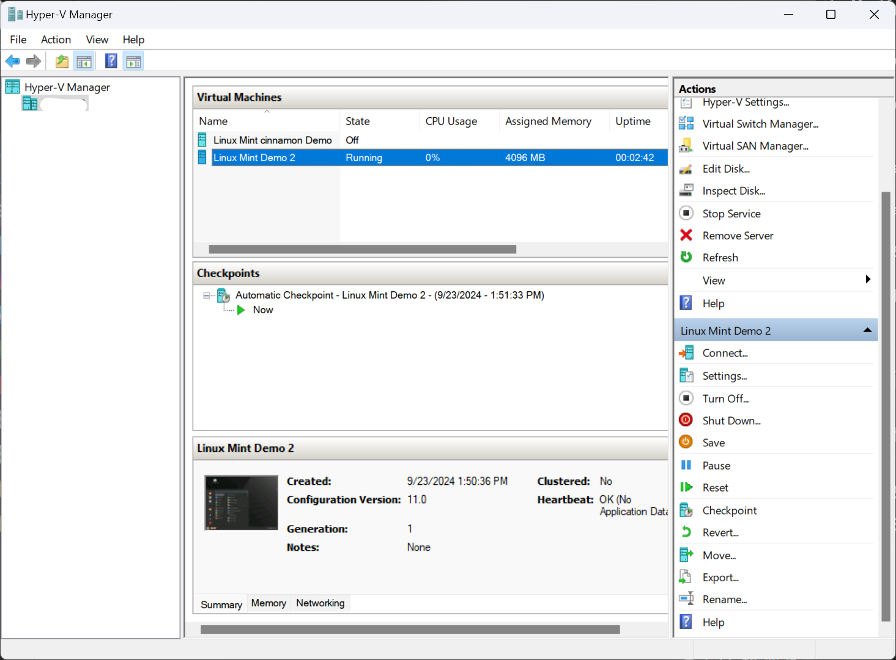
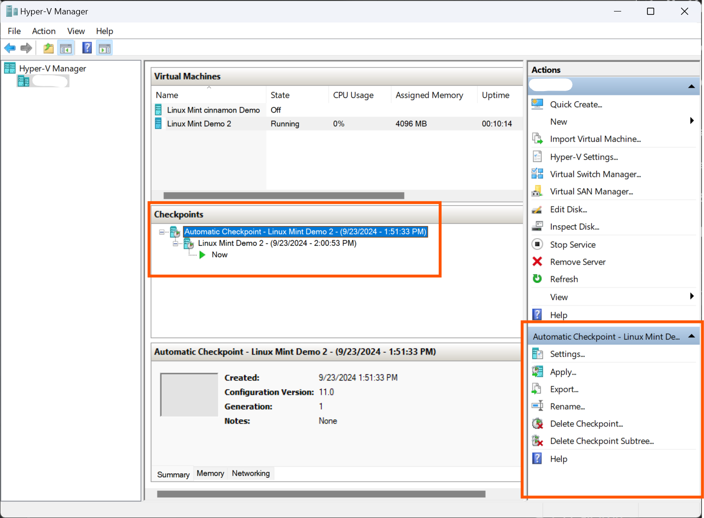

# Basic VM Creation and OS Installation

1. Open Hyper-V Manager

2. Create a new VM and specify settings (name, generation, memory, network).

3. Attach a bootable ISO (e.g., Ubuntu or Windows).

4. Start the VM and install the OS.

5. Explore the OS environment.

# Observing Power States of VMs in Hyper-V

To compare the effects of different methods of powering on and off VMs in Hyper-V, including:
- Standard Shutdown
- Power Off
- Save State
- Restart

Prerequisites:
- Hyper-V installed and configured on your Windows machine.
- At least two virtual machines created (you can use any OS, such as Windows or Linux).

Step 1: Create Two Virtual Machines
1. Open Hyper-V Manager:
    - Launch Hyper-V Manager from the Start menu.
2. Create Two VMs:
    - Follow the New Virtual Machine wizard:
      - VM 1: Name it TestVM1.
      - VM 2: Name it TestVM2.
    - Configure settings (memory, network, etc.) as needed.
    - Install the OS on both VMs.

Step 2: Start the VMs
1. Start TestVM1 and TestVM2:
    - Right-click on each VM and select Start.
    - Connect to both VMs to verify they are running.

Step 3: Observe Standard Shutdown
1. Shut Down from the Guest OS:
o For Windows: Click on the Start menu, select Power, and then Shut down.
    - For Linux: Open a terminal and run:

In linux use that command on terminal
`sudo shutdown now`

2. Observe in Hyper-V Manager:

    - After shutdown, the VM state will change to Off.

Step 4: Power Off the VM
1. Power Off Using Hyper-V:
    - Right-click on TestVM1 and select Turn Off.
2. Observe the Effect:
    - Check that the VM state shows as Off.
    - Compare the time taken to power off versus a standard shutdown.

Step 5: Save State
1. Save the State of a VM:
    - Right-click on TestVM2 and select Save.
2. Observe the VM State:
    - The VM will be saved and its state will change to Saved.
    - Note that this preserves the current state, allowing you to resume later.

Step 6: Restart the VMs
1. Restart TestVM1:
    - You can do this from the guest OS (Start menu &gt; Restart) or from Hyper-V (right-click &gt;
Restart).
2. Observe the Behavior:
    - Notice the time it takes for the VM to restart.

Step 7: Resume a Saved State
1. Resume TestVM2:
    - Right-click on TestVM2 and select Start.
    - Observe the difference in boot time compared to a standard boot from the Off state.

# Networking and Virtual Switches

Objective: Set up a virtual network using virtual switches.

Steps:
1. Create a new virtual switch (External, Internal, or Private).
2. Create two VMs and connect them to the virtual switch.
3. Configure network settings to allow communication between the VMs.
4. Use ping commands to test connectivity.
5. Explore different types of switches and their uses.

# Snapshot Management

Objective: Use snapshots (checkpoints) to manage VM states.

Steps:
1. Create a VM and install an OS (from Lab 1).
2. Take a snapshot after the OS installation.
3. Make changes to the VM (install software or modify settings).
4. Take another snapshot.
5. Revert to the first snapshot and observe the changes.
6. Delete snapshots and discuss the implications of managing them.

# Resource Allocation and Performance Monitoring

Objective: Manage resources and monitor performance in a VM.

Steps:
1. Create a VM and install an OS.
2. Use Task Manager (Windows) or System Monitor (Linux) to monitor CPU and memory usage.
3. Adjust VM resources (memory, CPU) in Hyper-V settings while the VM is off.
4. Start the VM and observe the impact of resource allocation on performance.
5. Experiment with setting resource limits and reservations.