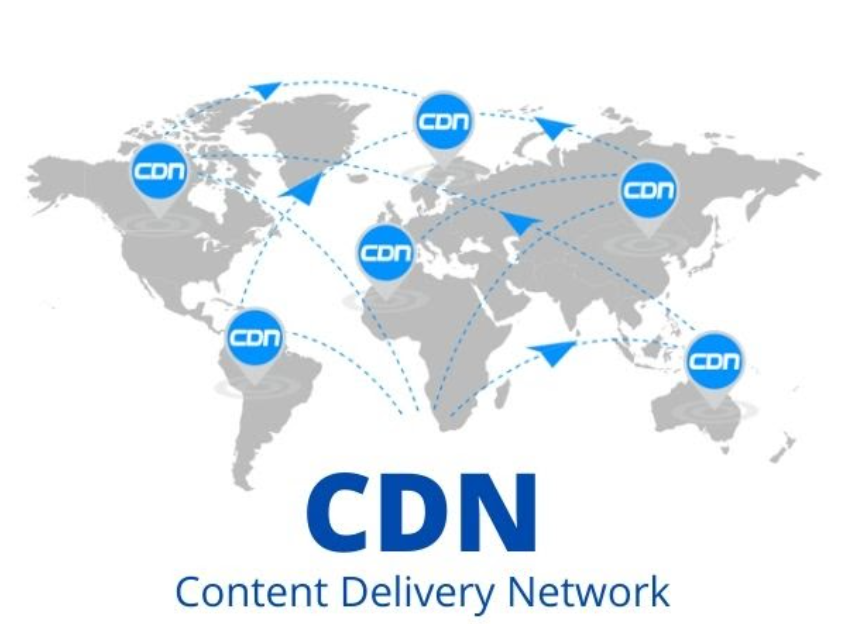

# CDN

CDN stands for content delivery network or content distribution network. It's a system of servers that are spread out around the world to deliver content to users quickly and efficiently.

Here's how a CDN works:

**Reduce distance**
CDNs store content on servers that are closer to users, which reduces the distance data has to travel. This results in faster loading times and improved performance. 

**Improve security**
CDNs can act as a virtual fence to protect websites from attacks. They can also block DDoS floods, which need to be mitigated outside of a core network. 

**Deliver different types of content**
CDNs can deliver static content, such as images and CSS, as well as dynamic content, which is generated by a web server. They can also deliver streaming content, such as videos and audio files. 

*CDNs can also help keep websites online by distributing network traffic evenly across servers and providing failover.*

