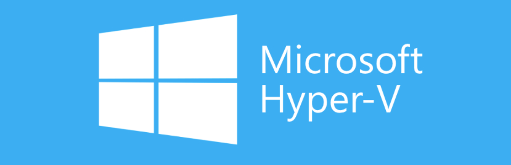

# Hyper-V

Hyper-V is a Microsoft product that allows users to create and run virtual machines (VMs) on a physical host computer. VMs are software versions of computers that can run operating systems and programs, and act like fully functional computers. 

Hyper-V uses a hypervisor, which is software that creates an abstraction layer between the virtual OS and the physical host machine. This allows multiple VMs to run on the same physical machine.

*Hyper-V is considered a Type 1 hypervisor (or bare-metal hypervisor) because it runs directly on the
host's hardware. Hyper-V installs on Windows but runs directly on the physical hardware, inserting itself underneath the host OS. It creates isolated partitions in which operating systems can operate.*

Hyper-V offers several benefits, including:

**Flexibility**
*Users can run more than one operating system on the same hardware, which can help save time and money.* 

**Isolation**
*Each VM runs in its own isolated space, which can help prevent crashes from affecting other workloads.* 

**Performance**
*By eliminating the overhead of a host operating system, Type 1 hypervisors like Hyper-V
typically offer better performance for virtual machines.*

**Direct Hardware Access**
*Hyper-V interacts directly with the physical hardware, allowing for efficient resource
management and performance.*

**Disaster recovery**
*Hyper-V Replica can asynchronously replicate VMs from a primary host to a secondary host, which can help with disaster recovery.* 

**Scalability**
*Hyper-V can manage a large number of virtual machines effectively, making it suitable for
enterprise environments.*

**Hardware utilization**
*Hyper-V can help users make better use of their hardware by consolidating more computing jobs onto less hardware.* 

**Support for Multiple Operating Systems**
*It can host various guest operating systems, including different versions of Windows and Linux.*

Hyper-V is included in many versions of Windows 11. 

Here are some important concepts related to Hyper-V:

**Hypervisor Types**
- **Type 1 (Bare-metal)**: Runs directly on hardware (e.g., Hyper-V).
- **Type 2 (Hosted)**: Runs on an operating system.

**Virtual Machines (VMs)**
- A VM is an emulation of a physical computer, running an operating system and applications.

**Virtual Hard Disks (VHD/VHDX)**
- **VHD**: Virtual hard disk format, limited to 2 TB.
- **VHDX**: Enhanced format, supports up to 64 TB, better performance, and resilience to power
failures.

**Virtual Switches**
- Networking component allowing VMs to communicate with each other and the external
network.
- Types: External, Internal, and Private.

**Resource Management**
- **Dynamic Memory**: Allocates memory dynamically based on demand.
- **CPU Allocation**: Configurable resources for VM performance.

**Checkpoints**
- Snapshots of the VM state, allowing rollback to a previous state for backup or testing.

**Live Migration**
- Moving a running VM from one host to another without downtime.

**High Availability (HA)**
- Ensures VMs are available in case of hardware failure, often using Failover Clustering.

**Replication**
- Hyper-V Replica allows you to replicate VMs to a secondary site for disaster recovery.

**Integration Services**
- Drivers and services that enhance VM performance and provide better interaction with the host
OS.

**Storage Options**
- Different storage types like SMB, iSCSI, and direct attached storage for VMs.

**Windows Server Roles**
- Hyper-V is a server role in Windows Server that enables virtualization.

**PowerShell and Management Tools**
- PowerShell commands and tools like Hyper-V Manager for automation and management.

**Networking Features**
- **NIC Teaming**: Combines multiple network adapters for redundancy and performance.
- **Network Virtualization**: Isolates network traffic between VMs.

**Security Features**
- **Secure Boot**: Protects the VM against boot-time attacks.
- **Shielded VMs**: Provides additional security for sensitive workloads.

## Virtual Network Switches

*Hyper-V provides three virtual network switches: private, internal, and external. The private switch enables communication between VMs, the internal switch allows communication between VMs and the host, and the external switch enables communication with the network.*

Hyper-V has three types of virtual switches that allow virtual machines (VMs) to communicate with each other and with the host computer and network:

**External virtual switch**\
Connects to a physical network through a network adapter on the host computer. VMs connected to the same external switch can communicate with each other, and the host operating system (OS) can communicate across external switches.

**Internal virtual switch**\
Does not connect to a physical network adapter, and instead uses software-defined networks. VMs and the host can communicate with each other through an internal switch.

**Private virtual switch**\
Similar to an internal switch, but does not connect to the host OS. VMs connected to a private switch can communicate with each other, but cannot communicate with anything outside of the private switch. 

*A virtual switch is a software-defined layer 2 switch that allows VMs to communicate with other computers. A VM can connect to multiple virtual switches.* 

**VLAN ID**\
In Hyper-V, a VLAN identifier specifies which virtual LAN (VLAN) a virtual machine (VM) can use to communicate over a network adapter. A VLAN ID is a number between 1 and 4094 that identifies a specific VLAN.
