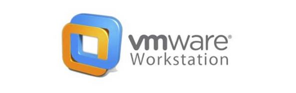

# VMware Workstation

VMware Workstation is a desktop virtualization product that allows users to run multiple operating systems on the same computer without rebooting.

VMware Workstation Pro is a hosted hypervisor that runs on x64 versions of Windows and Linux operating systems. There used to be an IA-32 version for earlier versions for the software. It enables users to set up virtual machines on a single physical machine and use them simultaneously along with the host machine.

VMware Workstation allows users to: 

**Create virtual machines**
*Users can create virtual machines that replicate server, desktop, and tablet environments.* 

**Allocate resources**
*Users can allocate resources like processor cores, memory, and graphics memory to each virtual machine.* 

**Develop and test software**
*Users can develop, test, and demonstrate software by running multiple operating systems simultaneously.* 

**Learn about technology**
*Users can build and test software, browsers, apps, and games.*

*VMware Workstation is available for Windows, Linux, and Mac computers. As of May 13, 2024, VMware Workstation Pro will be free for personal use, but commercial use will still require a license.*
