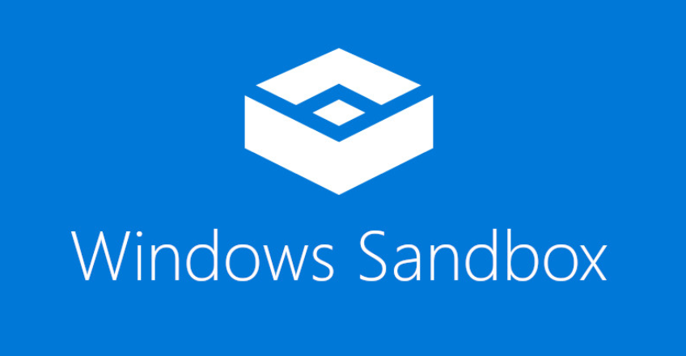

# Windows Sandbox

Windows Sandbox is a lightweight desktop environment that allows you to run applications in isolation from your host operating system. It's a safe space to test and debug apps, explore unknown files, or experiment with tools without risking your host OS. *Software installed inside the Windows Sandbox environment remains "sandboxed" and runs separately from the host machine.*

Windows Sandbox is a type 2 hypervisor. It uses a unique scheduling policy that allows the virtual processors of the sandbox to be scheduled like threads in a process. This means that the host manages Windows Sandbox as a process, which makes the host more responsive.

Here are some features of Windows Sandbox: 

**Disposable**
*When you close the sandbox, all the software, files, and state are deleted.* 

**Pristine**
*Each time you run the sandbox, it's as clean as a brand-new installation of Windows.* 

**Secure**
*Uses hardware-based virtualization for kernel isolation.* 

**Efficient** 
*Uses an integrated kernel scheduler, smart memory management, and virtual GPU.*

**Battery pass-through**
*Windows Sandbox is aware of the host's battery state and optimizes its power consumption.*

Windows Sandbox is built into Windows 10 Pro and Enterprise, and later versions like Windows 11 Pro and Enterprise. 
